<h1 align="left">
📊 Credit Card Fraud Analysis
</h1>

<p align="left">
Análisis exploratorio de transacciones con tarjetas de crédito utilizando SQL Server para identificar patrones de fraude y generar insights de negocio.
</p>

<p align="left">
  <a href="https://www.linkedin.com/in/diego-andres-gamero-cotrina-787511271/">
    
  </a>
  <a href="https://github.com/diegogameroc">
    
  </a>
</p>

---

## 📖 Resumen

Este proyecto analiza un conjunto de datos de transacciones con tarjetas de crédito con el objetivo de identificar patrones asociados al fraude mediante técnicas de análisis de datos utilizando SQL Server. Se desarrolló un proceso de preparación, limpieza y exploración de datos para responder preguntas de negocio relacionadas con el riesgo financiero y el comportamiento de usuarios, tarjetas y transacciones.

---

## 🎯 Objetivo del Proyecto

Identificar patrones asociados al fraude en transacciones con tarjetas de crédito mediante el análisis exploratorio de datos y consultas avanzadas en SQL, generando información que apoye la toma de decisiones en la gestión del riesgo. En particular, el proyecto busca:

- Analizar el comportamiento de las transacciones fraudulentas.
- Identificar perfiles de usuarios con mayor riesgo.
- Evaluar el impacto del uso del chip en el fraude.
- Analizar el comportamiento por marca y tipo de tarjeta.
- Construir un indicador de riesgo (Risk Score) que combine las señales más relevantes.
- Obtener insights que apoyen la toma de decisiones.

---

## 🛠 Herramientas utilizadas

<p align="center">


</p>

---

## 📂 Estructura del Proyecto

- [📁 Sobre los Datos](#-sobre-los-datos)
- [🏗️ Fase 1: Preparación y Calidad de los Datos](#️-fase-1-preparación-y-calidad-de-los-datos)
- [📊 Fase 2: Análisis Exploratorio de Datos (EDA)](#-fase-2-análisis-exploratorio-de-datos-eda)
- [🚨 Fase 3: Análisis del Riesgo de Fraude](#-fase-3-análisis-del-riesgo-de-fraude)
- [🎯 Fase 4: Construcción de un Risk Score](#-fase-4-construcción-de-un-risk-score)
- [📌 Conclusiones](#-conclusiones)

---

## 📁 Sobre los Datos

El proyecto utiliza un conjunto de datos de transacciones con tarjetas de crédito obtenido de Kaggle. El dataset original puede consultarse [aquí](https://www.kaggle.com/datasets/ealtman2019/credit-card-transactions).

**Tablas utilizadas:**

- **Datos_Usuarios:** información demográfica y financiera de los usuarios.
- **Tarjetas_Usuarios:** información de las tarjetas de crédito asociadas a cada usuario.
- **Transacciones_Tarjetas:** historial de transacciones, comercios y eventos de fraude.

En conjunto, estas tablas permiten analizar el comportamiento financiero de los usuarios, las características de sus tarjetas y los factores asociados a las transacciones fraudulentas.

### 👤 Datos_Usuarios

Contiene la información demográfica y financiera de cada usuario.

| Columna | Descripción |
|----------|-------------|
| User_ID | Identificador único del usuario. |
| Person | Nombre del usuario. |
| Current Age | Edad actual. |
| Retirement Age | Edad estimada de jubilación. |
| Birth Year / Birth Month | Año y mes de nacimiento. |
| Gender | Género. |
| Address, Apartment | Dirección del usuario. |
| City, State, Zipcode | Ubicación geográfica. |
| Latitude / Longitude | Coordenadas geográficas. |
| Per Capita Income - Zipcode | Ingreso per cápita del código postal. |
| Yearly Income - Person | Ingreso anual del usuario. |
| Total Debt | Deuda total del usuario. |
| FICO Score | Puntaje crediticio del usuario. |
| Num Credit Cards | Número de tarjetas de crédito registradas. |

---

### 💳 Tarjetas_Usuarios

Contiene la información de las tarjetas de crédito asociadas a cada usuario.

| Columna | Descripción |
|----------|-------------|
| User_ID | Identificador del usuario propietario de la tarjeta. |
| Card Index | Identificador de la tarjeta del usuario. |
| Card Brand | Marca de la tarjeta (Visa, Mastercard, etc.). |
| Card Type | Tipo de tarjeta (Crédito, Débito, etc.). |
| Card Number | Número de la tarjeta. |
| Expires | Fecha de vencimiento. |
| CVV | Código de seguridad. |
| Has Chip | Indica si la tarjeta posee chip. |
| Cards Issued | Número de tarjetas emitidas. |
| Credit Limit | Límite de crédito. |
| Acct Open Date | Fecha de apertura de la cuenta. |
| Year PIN Last Changed | Último año de cambio del PIN. |
| Card on Dark Web | Indica si la tarjeta ha sido encontrada en la Dark Web. |

---

### 💰 Transacciones_Tarjetas

Registra el historial de transacciones realizadas con las tarjetas.

| Columna | Descripción |
|----------|-------------|
| User_ID | Usuario que realizó la transacción. |
| Card | Tarjeta utilizada. |
| Year, Month, Day | Fecha de la transacción. |
| Time | Hora de la transacción. |
| Amount | Monto de la compra. |
| Use Chip | Método de pago utilizado (chip, banda, etc.). |
| Merchant Name | Identificador del comercio. |
| Merchant City | Ciudad del comercio. |
| Merchant State | Estado del comercio. |
| Zip | Código postal del comercio. |
| MCC | Merchant Category Code. |
| Errors | Error ocurrido durante la transacción, si existe. |
| Is Fraud | Indica si la transacción fue fraudulenta. |

---

### 🔗 Relación entre las tablas

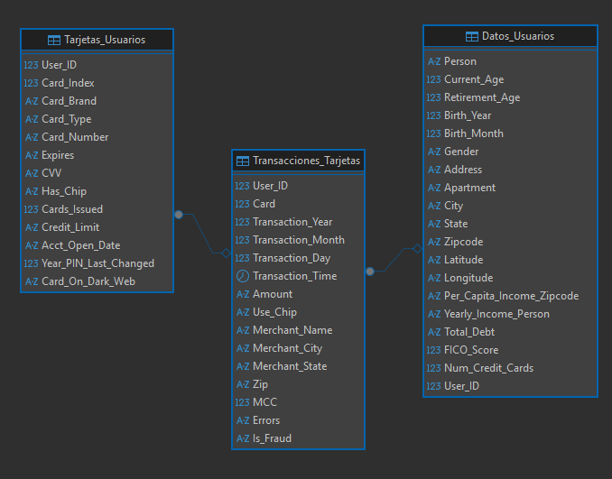

---

## 🏗️ Fase 1: Preparación y Calidad de los Datos

Antes de realizar el análisis exploratorio, se preparó la base de datos para garantizar la integridad y consistencia de la información. Esta etapa incluyó la creación de las tablas, la importación de los datos y la validación de posibles problemas de calidad.

### Actividades realizadas

- Creación de la base de datos `Credit_Card`.
- Diseño de las tablas `Datos_Usuarios`, `Tarjetas_Usuarios` y `Transacciones_Tarjetas`.
- Importación de los archivos CSV mediante `BULK INSERT`.
- Limpieza de caracteres especiales en la columna `Errors`.
- Conversión de campos monetarios (`Amount`, `Credit_Limit`, `Total_Debt`, `Yearly_Income_Person`) para facilitar su análisis.
- Validación de registros duplicados en usuarios y tarjetas.
- Definición de las relaciones entre las tablas mediante el identificador `User_ID`.

### Validaciones realizadas

✔️ Verificación de usuarios duplicados.

✔️ Verificación de tarjetas duplicadas.

✔️ Revisión de valores nulos e inconsistentes.

✔️ Comprobación de la correcta carga de los registros.

### Resultado

Como resultado de esta fase, se obtuvo una base de datos consistente y preparada para el análisis exploratorio, garantizando que las consultas posteriores se realizaran sobre información limpia y estructurada.

---

## 📊 Fase 2: Análisis Exploratorio de Datos (EDA)

Antes de construir cualquier indicador de fraude, es necesario entender la estructura, el volumen y la distribución de los datos disponibles. Esta fase responde preguntas básicas sobre el dataset: cuántos registros hay, qué período cubren, y cómo se distribuyen los usuarios, tarjetas y transacciones — sentando la base para interpretar correctamente los análisis de riesgo de la Fase 3.

**📌 Panorama general del dataset**

```sql
-- Volumen total de registros en cada tabla
SELECT 'Transacciones' AS Tabla, COUNT(1) AS Total_Registros FROM dbo.Transacciones_Tarjetas
UNION ALL
SELECT 'Usuarios', COUNT(1) FROM dbo.Datos_Usuarios
UNION ALL
SELECT 'Tarjetas', COUNT(1) FROM dbo.Tarjetas_Usuarios;

-- Rango de fechas que cubre el dataset
SELECT
    MIN(Transaction_Year) AS Anio_Inicio,
    MAX(Transaction_Year) AS Anio_Fin,
    COUNT(DISTINCT Transaction_Year) AS Cantidad_Anios
FROM dbo.Transacciones_Tarjetas;

-- Distribución de usuarios únicos y tarjetas únicas en las transacciones
SELECT
    COUNT(DISTINCT User_ID) AS Usuarios_Unicos,
    COUNT(DISTINCT CONCAT(User_ID,'-',Card)) AS Tarjetas_Unicas
FROM dbo.Transacciones_Tarjetas;
```

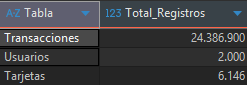

El dataset cubre transacciones desde **1991** hasta **2020** (30 años), con **2,000** usuarios únicos y **6,139** tarjetas únicas registrando actividad en las transacciones.

**Distribución de transacciones**

```sql
SELECT
    Transaction_Year,
    COUNT(1) AS Total_Transactions
FROM dbo.Transacciones_Tarjetas
GROUP BY Transaction_Year
ORDER BY Transaction_Year;
```

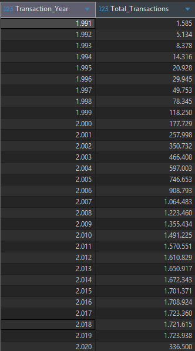

Las transacciones crecen año a año desde 1991 hasta estabilizarse entre 2013 y 2019, con alrededor de 1.7M transacciones anuales. El año 2020 tiene muchas menos transacciones (336,500) porque el dataset solo cubre parte de ese año.

**Por tipo de transacción**

```sql
-- Distribución por tipo de transacción (Swipe, Chip, Online)
SELECT
    Use_Chip,
    COUNT(1) AS Total_Transactions,
    ROUND(COUNT(1) * 100.0 / SUM(COUNT(1)) OVER(), 2) AS Porcentaje
FROM dbo.Transacciones_Tarjetas
GROUP BY Use_Chip
ORDER BY Total_Transactions DESC;
```

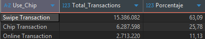

El 63% de las transacciones se realiza con Swipe (banda magnética), 26% con Chip y solo 11% de forma online. Esta distribución es relevante porque, como se detalla en la Fase 3, el canal con menor volumen (Online) es el que concentra la mayor tasa de fraude — lo que indica que el riesgo no está asociado al volumen de transacciones, sino al nivel de seguridad de cada canal. Swipe, al ser el método más antiguo y con menos validaciones, también presenta un riesgo considerable pese a su alto uso.

**Top 10 estados con más transacciones**

```sql
SELECT TOP 10
    Merchant_State,
    COUNT(1) AS Total_Transactions
FROM dbo.Transacciones_Tarjetas
WHERE Merchant_State IS NOT NULL
GROUP BY Merchant_State
ORDER BY Total_Transactions DESC;
```

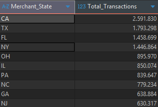

California, Texas, Florida y Nueva York concentran el mayor volumen de transacciones, lo cual es esperable al ser los estados más poblados de EE.UU.

**Top 10 tipos de comercio (MCC) con más transacciones**

```sql
SELECT TOP 10
    MCC,
    COUNT(1) AS Total_Transactions
FROM dbo.Transacciones_Tarjetas
GROUP BY MCC
ORDER BY Total_Transactions DESC;
```

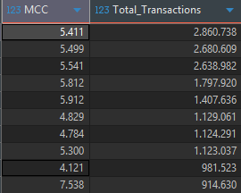

Los MCC con más transacciones corresponden a categorías de consumo habitual como supermercados, gasolineras, restaurantes y farmacias — es decir, el gasto cotidiano de los usuarios.

**Distribución de tarjetas por marca**

```sql
SELECT
    Card_Brand,
    COUNT(1) AS Total_Tarjetas,
    ROUND(COUNT(1) * 100.0 / SUM(COUNT(1)) OVER(), 2) AS Porcentaje
FROM dbo.Tarjetas_Usuarios
GROUP BY Card_Brand
ORDER BY Total_Tarjetas DESC;
```

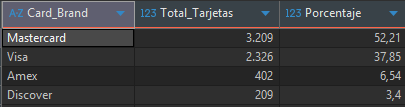

Mastercard y Visa concentran el 90% de las tarjetas del dataset, mientras que Amex y Discover tienen una participación mucho menor.

---

## 🚨 Fase 3: Análisis del Riesgo de Fraude

### 📌 Fórmula utilizada

La principal métrica del proyecto es la **Tasa de Fraude (Fraud Rate)**.

```text
Fraud Rate (%) =
(Transacciones Fraudulentas / Total de Transacciones) × 100
```

En SQL, esta métrica se calcula utilizando agregaciones y expresiones `CASE WHEN`, permitiendo obtener la tasa de fraude para diferentes segmentos de usuarios, tarjetas y transacciones.

### 📈 KPIs del Proyecto

Para evaluar los factores asociados al fraude en transacciones con tarjetas de crédito, se definieron los siguientes indicadores clave de desempeño (KPIs):

| KPI | Descripción | Objetivo |
|------|-------------|----------|
| **Fraud Rate General** | Porcentaje de transacciones fraudulentas sobre el total de transacciones. | Medir la incidencia general del fraude. |
| **Fraud Rate por Marca de Tarjeta** | Tasa de fraude según la marca de tarjeta (Visa, Mastercard, Amex, Discover). | Identificar si alguna marca concentra mayor riesgo. |
| **Fraud Rate por Tipo de Transacción** | Comparación de la tasa de fraude entre Swipe, Chip y Online. | Evaluar el impacto del canal de pago como mecanismo de seguridad. |
| **Fraud Rate por Monto de Transacción** | Tasa de fraude según el rango de monto (micro-gasto, gasto diario, gasto fuerte). | Identificar si los montos altos concentran mayor riesgo. |
| **Fraud Rate por Estado** | Tasa de fraude por estado de residencia del usuario. | Detectar zonas geográficas con mayor incidencia de fraude. |
| **Fraud Rate por Comercio (MCC)** | Tasa de fraude según el tipo de comercio donde se realiza la transacción. | Identificar categorías de comercio con mayor exposición al fraude. |
| **Fraud Rate por FICO Score** | Tasa de fraude según el segmento de puntaje crediticio del usuario. | Analizar si el riesgo crediticio está asociado al fraude. |
| **Fraud Rate por Límite de Crédito** | Tasa de fraude por rango de límite de crédito. | Identificar si la capacidad crediticia influye en la exposición al fraude. |
| **Fraud Rate por Errores de Transacción** | Tasa de fraude en transacciones con errores críticos (CVV, PIN, número de tarjeta, expiración). | Evaluar si los errores de validación están relacionados con fraude. |
| **Fraud Rate por Número de Tarjetas** | Tasa de fraude según la cantidad de tarjetas asociadas al usuario. | Analizar si el número de tarjetas influye en el riesgo de fraude. |

### **Pregunta #1: ¿Cuál es el Fraud Rate general?**

Encontré el Fraud Rate general utilizando las funciones ROUND, SUM, CASE y COUNT dentro de un CTE. Usé ROUND con 2 decimales para que el porcentaje sea legible sin perder precisión.

```sql
WITH CTE_KPI AS(
SELECT 
SUM(CASE 
		WHEN Is_Fraud='Yes' THEN 1
		ELSE 0
	END
	) Cant_Fraud,
COUNT(1) AS Total_Transactions
FROM dbo.Transacciones_Tarjetas
)
SELECT
Cant_Fraud,
Total_Transactions,
ROUND(Cant_Fraud*100.00/Total_Transactions,2) AS Fraud_Rate
FROM CTE_KPI
```

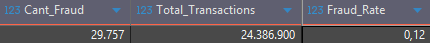

**Hallazgo:** de 24.4 millones de transacciones, solo el 0.12% son fraude, cerca de 30,000 casos. Es una tasa baja, pero sirve como línea base: cualquier segmento que la supere se considera de mayor riesgo relativo.

**Recomendación:** aunque el porcentaje es bajo, el volumen de casos justifica mantener un monitoreo activo, ya que cada transacción fraudulenta representa una pérdida directa para el negocio.

### **Pregunta #2: ¿Qué marca de tarjeta presenta mayor riesgo de fraude?**

Encontré el Fraud Rate por marca de tarjeta utilizando un JOIN entre las tablas de tarjetas y transacciones, y las funciones SUM, CASE, COUNT y GROUP BY. Usé ROUND con 4 decimales en vez de 2, porque las diferencias entre marcas eran muy pequeñas y con solo 2 decimales varias tasas se veían iguales.

```sql
WITH CTE_T1 AS (
SELECT 
tu.Card_Brand AS Marca,
COUNT(1) AS Total_Transactions,
SUM(CASE 
		WHEN tt.Is_Fraud='Yes' THEN 1
		ELSE 0 
	END
) AS Cant_Fraud
FROM dbo.Tarjetas_Usuarios as tu
INNER JOIN dbo.Transacciones_Tarjetas as tt
ON tu.Card_Index=tt.Card AND tu.User_ID=tt.User_ID
GROUP BY tu.Card_Brand
)
SELECT
Marca,
Cant_Fraud,
Total_Transactions,
ROUND(Cant_Fraud*100.00/Total_Transactions,4) AS Fraud_Rate
FROM CTE_T1
ORDER BY Fraud_Rate DESC
```

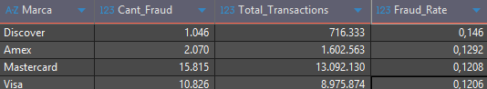

**Hallazgo:** Discover tiene la tasa de fraude más alta (0.146%), aunque es la marca con menos transacciones. Mastercard y Visa, con el 90% del volumen, tienen tasas similares y más bajas (0.121%).

**Recomendación:** revisar controles antifraude en Discover, aunque el bajo volumen puede estar inflando el resultado. En Mastercard y Visa, cualquier mejora en controles tiene mayor impacto porque concentran casi todo el volumen de transacciones.

### **Pregunta #3: ¿Las transacciones online son más vulnerables que las de chip?**

Encontré el Fraud Rate por tipo de transacción utilizando dos CTEs encadenados, con SUM, CASE, COUNT y GROUP BY. Agregué una subconsulta para calcular el Risk_Ratio, tomando Chip como base (valor 1.0) y comparando las otras modalidades contra ella.

```sql
WITH CTE_KPI AS (
    SELECT 
        Use_Chip,
        SUM(CASE 
                WHEN Is_Fraud = 'Yes' THEN 1
                ELSE 0
            END) AS Cant_Fraud,
        COUNT(*) AS Total_Transactions
    FROM dbo.Transacciones_Tarjetas
    GROUP BY Use_Chip
),
CTE_FRAUD AS (
    SELECT
        Use_Chip,
        Cant_Fraud,
        Total_Transactions,
        ROUND(Cant_Fraud * 100.0 / Total_Transactions, 4) AS Fraud_Rate
    FROM CTE_KPI
)

SELECT
    Use_Chip,
    Cant_Fraud,
    Total_Transactions,
    Fraud_Rate,
    ROUND(
        Fraud_Rate /
        (
            SELECT Fraud_Rate
            FROM CTE_FRAUD
            WHERE Use_Chip = 'Chip Transaction'
        ),
        2
    ) AS Risk_Ratio
FROM CTE_FRAUD 
ORDER BY Risk_Ratio DESC;
```

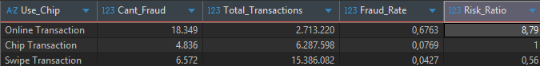

**Hallazgo:** las transacciones online tienen un Fraud Rate casi 9 veces mayor que las de chip, a pesar de representar solo el 11% del volumen total. Swipe, en cambio, es el canal más seguro en términos relativos, incluso por debajo de chip.

**Recomendación:** reforzar la autenticación en transacciones online (por ejemplo, verificación adicional en compras de monto alto) debería tener el mayor impacto en reducción de fraude, ya que es el canal de mayor riesgo relativo. No es prioritario invertir en mejoras para Swipe o Chip, dado que ya muestran un riesgo bajo y controlado.

### **Pregunta #4: ¿Cómo varía la tasa de fraude según el monto de la transacción?**

Encontré el Fraud Rate por rango de monto utilizando un CTE con CASE para categorizar cada transacción, y luego SUM, COUNT y GROUP BY. Definí los rangos como Micro-gasto (<$10), Gasto Diario ($10-$600) y Gasto Fuerte (>$600), basándome en la distribución general de los montos.

```sql
WITH CTE_KPI AS (
    SELECT 
        CASE
            WHEN ROUND(CAST(REPLACE(Amount,'$','') AS FLOAT),2) < 10 THEN 'Micro-gasto'
            WHEN ROUND(CAST(REPLACE(Amount,'$','') AS FLOAT),2) <= 600 THEN 'Gasto Diario'
            ELSE 'Gasto Fuerte'
        END AS Categoria_Gasto,
        CASE 
            WHEN Is_Fraud = 'Yes' THEN 1
            ELSE 0
        END AS Fraud_Flag
    FROM dbo.Transacciones_Tarjetas
)
SELECT
    Categoria_Gasto,
    COUNT(*) AS Total_Transactions,
    SUM(Fraud_Flag) AS Cant_Fraud,
    ROUND(SUM(Fraud_Flag) * 100.0 / COUNT(*), 4) AS Fraud_Rate
FROM CTE_KPI
GROUP BY Categoria_Gasto
ORDER BY Fraud_Rate DESC;
```

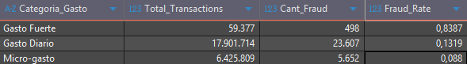

**Hallazgo:** el Gasto Fuerte tiene el Fraud Rate más alto (0.84%), más de 6 veces el promedio general. Pero representa apenas 59,377 transacciones, una fracción mínima del total (24.4M) — la mayoría del gasto de los usuarios se concentra en el rango Diario y Micro-gasto, donde el fraude es proporcionalmente menor.

**Recomendación:** aplicar validaciones adicionales (como confirmación por otro medio) a transacciones de monto alto, ya que ahí se concentra el mayor riesgo relativo. Al ser un volumen bajo de transacciones, esta medida no afectaría la experiencia de la mayoría de los usuarios.

### **Pregunta #5: ¿Qué estados concentran la mayor tasa de fraude?**

Encontré el Fraud Rate por estado utilizando dos JOIN para llegar desde transacciones hasta el estado del usuario, y SUM, CASE, COUNT y GROUP BY. Agregué un HAVING con mínimo de 50,000 transacciones para asegurar que cada estado tenga volumen suficiente y la tasa sea representativa.

```sql
WITH CTE_BASE AS (
    SELECT
        d.State,
        CASE
            WHEN t.Is_Fraud = 'Yes' THEN 1
            ELSE 0
        END AS Fraud_Flag
    FROM dbo.Transacciones_Tarjetas t
    INNER JOIN dbo.Tarjetas_Usuarios tu
        ON t.User_ID = tu.User_ID
       AND t.Card = tu.Card_Index
    INNER JOIN dbo.Datos_Usuarios d
        ON tu.User_ID = d.User_ID
)

SELECT
    State,
    COUNT(*) AS Total_Transactions,
    SUM(Fraud_Flag) AS Cant_Fraud,
    ROUND(SUM(Fraud_Flag) * 100.0 / COUNT(*), 4) AS Fraud_Rate
FROM CTE_BASE
GROUP BY State
HAVING COUNT(1) >= 50000
ORDER BY Fraud_Rate DESC;
```

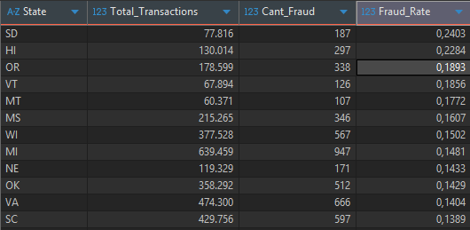

**Hallazgo:** South Dakota, Hawái y Oregon concentran la mayor tasa de fraude, prácticamente el doble del promedio general (0.12%). Los estados con mayor volumen de transacciones (CA, TX, FL, NY) se ubican en un rango medio-bajo, sin destacar como focos de riesgo.

**Recomendación:** priorizar revisión de controles antifraude en SD, HI y OR. En los estados grandes (CA, TX, FL, NY), el estado por sí solo no es una señal fuerte — conviene combinarlo con otras variables como tipo de transacción o monto antes de tomar decisiones.

### **Pregunta #6: ¿Qué tipos de comercio (MCC) concentran las mayores tasas de fraude?**

Encontré el Fraud Rate por comercio (MCC) utilizando CASE, SUM, COUNT y GROUP BY. Agregué un HAVING con mínimo de 5,000 transacciones para descartar comercios con poco volumen y evitar tasas poco representativas.

```sql
WITH CTE_BASE AS (
    SELECT 
         MCC,
        CASE 
            WHEN Is_Fraud = 'Yes' THEN 1
            ELSE 0
        END AS Fraud_Flag
    FROM dbo.Transacciones_Tarjetas 
)

SELECT
    MCC,
    COUNT(1) AS Total_Transactions,
    SUM(Fraud_Flag) AS Cant_Fraud,
    ROUND(SUM(Fraud_Flag) * 100.0 / COUNT(1), 4) AS Fraud_Rate
FROM CTE_BASE
GROUP BY MCC
HAVING COUNT(1) >= 5000
ORDER BY Fraud_Rate DESC;
```

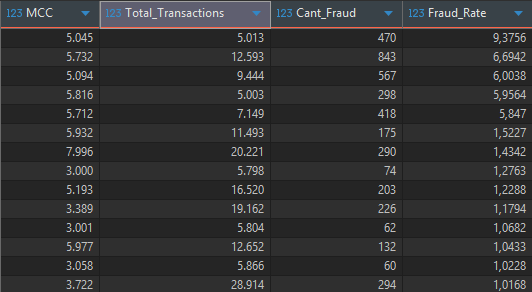

**MCC con mayor tasa de fraude:**

| MCC | Categoría | Total Transacciones | Fraud Rate |
|---|---|---|---|
| 5045 | Computadoras y equipos periféricos | 5,013 | 9.38% |
| 5732 | Tiendas de electrónica | 12,593 | 6.69% |
| 5094 | Joyería, relojes y metales preciosos | 9,444 | 6.00% |
| 5816 | Bienes digitales (juegos) | 5,003 | 5.96% |
| 5712 | Muebles y artículos para el hogar | 7,149 | 5.85% |

**MCC con menor tasa de fraude:**

| MCC | Categoría | Total Transacciones | Fraud Rate |
|---|---|---|---|
| 7538 | Lavado de autos | 914,630 | 0.0056% |
| 5499 | Tiendas de conveniencia | 2,680,609 | 0.0097% |
| 5541 | Gasolineras | 2,638,982 | 0.0134% |
| 5812 | Restaurantes | 1,797,920 | 0.0182% |
| 5411 | Supermercados | 2,860,738 | 0.0330% |

**Hallazgo:** hay un grupo pequeño de comercios (equipos de cómputo, electrónica, joyería, bienes digitales, muebles) con tasas de fraude muy por encima del resto, entre 5% y 9%, mientras que el promedio general es 0.12%. En contraste, los comercios de mayor volumen del dataset (supermercados MCC 5411, restaurantes MCC 5812, farmacias MCC 5912) tienen tasas bajísimas, cercanas a 0%. Esto confirma lo que se vio en la Fase 2: los comercios con más transacciones no son los de mayor riesgo.

**Recomendación:** enfocar las reglas de validación adicional en comercios de electrónica, equipos y bienes de alto valor, ya que ahí se concentra el fraude relativo más fuerte. No es necesario aplicar fricción extra en supermercados o restaurantes, donde el fraude es prácticamente nulo y añadir controles solo afectaría la experiencia del usuario sin beneficio real.

### **Pregunta #7: ¿Cómo varía la tasa de fraude según el FICO Score de los usuarios?**

Encontré el Fraud Rate por segmento de FICO Score utilizando un JOIN entre transacciones y usuarios, CASE para clasificar el riesgo, y SUM, COUNT y GROUP BY. Definí los rangos como Riesgo Alto (<650), Riesgo Medio (650-750) y Riesgo Bajo (>750).

```sql
WITH CTE_BASE AS (
    SELECT
    	us.User_ID,
        us.FICO_Score,
        CASE 
            WHEN t.Is_Fraud = 'Yes' THEN 1
            ELSE 0
        END AS Fraud_Flag,
        CASE 
        	WHEN us.FICO_SCORE <650 THEN 'Riesgo Alto'
        	WHEN us.FICO_SCORE <=750 THEN 'Riesgo Medio'
        	ELSE 'Riesgo Bajo' 
        END AS Segmento_Fico
    FROM dbo.Transacciones_Tarjetas t
    INNER JOIN dbo.Datos_Usuarios us
    ON  us.User_ID = t.User_ID
)
SELECT
	Segmento_Fico,
	COUNT(1) AS Total_Transactions,
    SUM(Fraud_Flag) AS Cant_Fraud,
    ROUND(SUM(Fraud_Flag) * 100.0 / COUNT(1), 4) AS Fraud_Rate
FROM CTE_BASE
GROUP BY Segmento_Fico
ORDER BY Fraud_Rate DESC
```

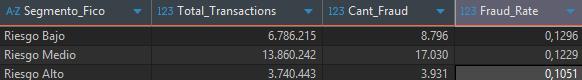

**Hallazgo:** el resultado es contraintuitivo — los usuarios con FICO Score más alto (Riesgo Bajo, mejor historial crediticio) tienen la tasa de fraude más alta, y los de FICO más bajo (Riesgo Alto) tienen la más baja. Esto sugiere que el FICO Score no está midiendo el mismo tipo de riesgo que el fraude: un buen historial crediticio no protege contra ser víctima de fraude (robo de tarjeta, phishing, etc.), que depende más del comportamiento del defraudador que del usuario.

**Recomendación:** no usar el FICO Score como variable de riesgo de fraude en las reglas de monitoreo, ya que la relación es débil e incluso inversa a lo esperado. El FICO Score es útil para riesgo crediticio (probabilidad de impago), pero no es un buen predictor de fraude transaccional.

### **Pregunta #8: ¿Cómo varía la tasa de fraude según el límite de crédito de los usuarios?**

Encontré el Fraud Rate por límite de crédito utilizando un JOIN entre transacciones y tarjetas (uniendo por usuario y por tarjeta específica, no solo por usuario), CASE para segmentar el límite en cuartiles, y SUM, COUNT y GROUP BY.

```sql
WITH CTE_BASE AS (
    SELECT
    	CAST(REPLACE(tu.Credit_Limit,'$','') AS FLOAT) Credit_Limit,
        CASE 
            WHEN t.Is_Fraud = 'Yes' THEN 1
            ELSE 0
        END AS Fraud_Flag,
        CASE 
        	WHEN CAST(REPLACE(tu.Credit_Limit,'$','') AS FLOAT) <7043 THEN 'Bajo'
        	WHEN CAST(REPLACE(tu.Credit_Limit,'$','') AS FLOAT) <=12593 THEN 'Medio'
        	WHEN CAST(REPLACE(tu.Credit_Limit,'$','') AS FLOAT) <=19157 THEN 'Alto'
        	ELSE 'Premium' 
        END AS Segmento_Credito
    FROM dbo.Transacciones_Tarjetas t
    INNER JOIN dbo.Tarjetas_Usuarios as tu
    ON  t.User_ID = tu.User_ID
    AND t.Card = tu.Card_Index
)
SELECT
Segmento_Credito,
COUNT(1) Total_Transactions,
SUM(Fraud_Flag) Cant_Fraud,
ROUND(SUM(Fraud_Flag)*100.00/COUNT(1),4) Fraud_Rate
FROM CTE_BASE
GROUP BY Segmento_Credito
ORDER BY Fraud_Rate DESC
```

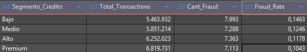

**Hallazgo:** la tasa de fraude baja de forma constante a medida que sube el límite de crédito. Los usuarios con límite Bajo tienen 40% más fraude que los Premium. Este patrón es similar al del FICO Score: usuarios con perfiles financieros más sólidos (mayor límite) presentan menos fraude, posiblemente porque tienen tarjetas más antiguas, mejor monitoreo del banco, o mayor familiaridad con el uso seguro de sus tarjetas.

**Recomendación:** reforzar el monitoreo y las validaciones adicionales en usuarios con límite de crédito bajo, ya que concentran proporcionalmente más fraude. Esto no significa restringir su acceso, sino aplicar controles más estrictos (como confirmaciones extra en compras grandes) en ese segmento específico.

### **Pregunta #9: ¿Las transacciones con errores tienen mayor tasa de fraude?**

Encontré el Fraud Rate por tipo de error utilizando CASE, SUM, COUNT y GROUP BY, filtrando solo transacciones con error registrado y con un mínimo de 1,000 casos para que la tasa sea representativa.

```sql
WITH CTE_BASE AS (
    SELECT
    	Errors,
        CASE 
            WHEN Is_Fraud = 'Yes' THEN 1
            ELSE 0
        END AS Fraud_Flag
    FROM dbo.Transacciones_Tarjetas
)

SELECT 
Errors,
COUNT(1) AS Total_Transactions,
SUM(Fraud_Flag) AS Cant_Fraud,
ROUND(SUM(Fraud_Flag)*100.00/COUNT(1),4) AS Fraud_Rate
FROM CTE_BASE
WHERE Errors is not NULL 
GROUP BY Errors
HAVING COUNT(1)>1000
ORDER BY Fraud_Rate DESC
```

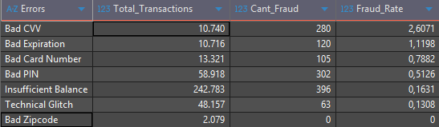

**Hallazgo:** los errores relacionados con datos de la tarjeta (CVV, fecha de expiración, número de tarjeta) tienen tasas de fraude muy por encima del promedio general (0.12%), siendo Bad CVV el más alto con 2.6%, 21 veces el promedio. En cambio, errores más operativos como Saldo Insuficiente o Fallo Técnico tienen tasas bajas, cercanas al promedio. Esto tiene sentido: un defraudador que no tiene la tarjeta física suele fallar en los datos que necesita adivinar (CVV, número completo), mientras que un usuario legítimo casi nunca se equivoca en esos datos.

**Recomendación:** tratar los errores de CVV, expiración y número de tarjeta como señal de alerta temprana — varios intentos fallidos de este tipo en poco tiempo, sobre la misma tarjeta, deberían activar un bloqueo temporal o verificación adicional. Los errores de saldo insuficiente o fallas técnicas no requieren esta atención, ya que son parte del uso normal.

### **Pregunta #10: ¿Cómo varía la tasa de fraude según el número de tarjetas que posee un usuario?**

Encontré el Fraud Rate por número de tarjetas utilizando un JOIN entre transacciones y usuarios, CASE para segmentar la cantidad de tarjetas, y SUM, COUNT y GROUP BY.

```sql
WITH CTE_BASE AS (
    SELECT
        CASE
            WHEN us.Num_Credit_Cards >= 6 THEN '6+ Tarjetas'
            WHEN us.Num_Credit_Cards = 5 THEN '5 Tarjetas'
            WHEN us.Num_Credit_Cards = 4 THEN '4 Tarjetas'
            WHEN us.Num_Credit_Cards = 3 THEN '3 Tarjetas'
            WHEN us.Num_Credit_Cards = 2 THEN '2 Tarjetas'
            ELSE '1 Tarjeta'
        END AS Segmento_Tarjetas,
        
        CASE
            WHEN t.Is_Fraud = 'Yes' THEN 1
            ELSE 0
        END AS Fraud_Flag
        
    FROM dbo.Transacciones_Tarjetas AS t
    INNER JOIN dbo.Datos_Usuarios AS us
        ON t.User_ID = us.User_ID
)

SELECT
    Segmento_Tarjetas,
    COUNT(*) AS Total_Transactions,
    SUM(Fraud_Flag) AS Cant_Fraud,
    ROUND(SUM(Fraud_Flag) * 100.0 / COUNT(*), 4) AS Fraud_Rate
FROM CTE_BASE
GROUP BY Segmento_Tarjetas
ORDER BY Fraud_Rate DESC
```

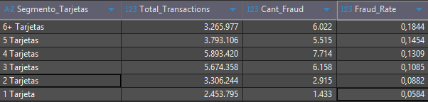

**Hallazgo:** la tasa de fraude sube de forma constante con el número de tarjetas del usuario. Quienes tienen 6 o más tarjetas presentan más del triple de fraude que quienes tienen solo 1 (0.184% vs 0.058%). Tiene sentido: más tarjetas activas significa más superficie de exposición — más números de tarjeta que pueden filtrarse, más puntos de entrada para un defraudador.

**Recomendación:** aplicar mayor monitoreo a usuarios con 5 o más tarjetas activas, ya que concentran proporcionalmente más fraude. También se podría evaluar si varias de esas tarjetas están realmente en uso o si conviene sugerir al usuario cancelar las inactivas, reduciendo su exposición.

---

## 🎯 Fase 4: Construcción de un Risk Score

Construí el score sumando 6 señales de riesgo ya validadas en el análisis anterior: transacción online, monto alto, MCC de alto riesgo, límite de crédito bajo, error crítico de tarjeta y usuario con 5 o más tarjetas. Cada señal suma 1 punto, dando un score de 0 a 6 puntos por transacción. En la práctica, ninguna transacción del dataset acumuló las 6 señales a la vez — el score máximo observado fue 5.


```sql
WITH CTE_Flags AS (
    SELECT
        t.User_ID,
        t.Card,
        t.Amount,
        t.Use_Chip,
        t.Errors,
        t.MCC,
        t.Is_Fraud,
        tu.Credit_Limit,
        us.Num_Credit_Cards,

        CASE WHEN t.Use_Chip = 'Online Transaction' THEN 1 ELSE 0 END AS Flag_Online,
        CASE WHEN ROUND(CAST(REPLACE(t.Amount,'$','') AS FLOAT),2) > 600 THEN 1 ELSE 0 END AS Flag_Monto_Alto,
        CASE WHEN t.Errors IN ('Bad CVV','Bad Expiration','Bad Card Number','Bad PIN') THEN 1 ELSE 0 END AS Flag_Error_Critico,
        CASE WHEN CAST(REPLACE(tu.Credit_Limit,'$','') AS FLOAT) < 7043 THEN 1 ELSE 0 END AS Flag_Limite_Bajo,
        CASE WHEN t.MCC IN (5045,5732,5094,5816,5712) THEN 1 ELSE 0 END AS Flag_MCC_Riesgo,
        CASE WHEN us.Num_Credit_Cards >= 5 THEN 1 ELSE 0 END AS Flag_Muchas_Tarjetas

    FROM dbo.Transacciones_Tarjetas t
    INNER JOIN dbo.Tarjetas_Usuarios tu
        ON t.User_ID = tu.User_ID
       AND t.Card = tu.Card_Index
    INNER JOIN dbo.Datos_Usuarios us
        ON t.User_ID = us.User_ID
),

CTE_Score AS (
    SELECT
        *,
        (Flag_Online + Flag_Monto_Alto + Flag_Error_Critico + Flag_Limite_Bajo + Flag_MCC_Riesgo + Flag_Muchas_Tarjetas) AS Risk_Score
    FROM CTE_Flags
)

SELECT
    Risk_Score,
    COUNT(1) AS Total_Transactions,
    SUM(CASE WHEN Is_Fraud = 'Yes' THEN 1 ELSE 0 END) AS Cant_Fraud,
    ROUND(SUM(CASE WHEN Is_Fraud = 'Yes' THEN 1 ELSE 0 END) * 100.0 / COUNT(1), 4) AS Fraud_Rate
FROM CTE_Score
GROUP BY Risk_Score
ORDER BY Risk_Score DESC;
```

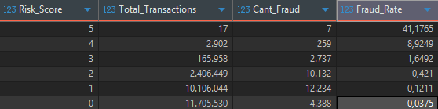

**Hallazgo:** el Fraud Rate sube de forma constante y muy marcada con el Risk Score. Las transacciones con 5 señales presentes tienen una tasa de fraude de 41.18%, más de 1,000 veces superior al grupo sin ninguna señal (0.04%). Las transacciones con score 3 o más representan menos del 1% del volumen total, pero concentran cerca del 10% de todo el fraude del dataset.

**Recomendación:** las transacciones con score 4 o 5 deberían bloquearse o requerir verificación inmediata, ya que más del 8% (score 4) y más del 40% (score 5) resultan ser fraude real. Las de score 3 ameritan revisión prioritaria, aunque con menor urgencia. Las de score 0 o 1 no requieren revisión adicional, ya que su tasa de fraude está en línea o por debajo del promedio general.

---

## 📌 Conclusiones

Este proyecto analizó más de 24 millones de transacciones con tarjetas de crédito para identificar patrones de fraude y traducirlos en recomendaciones de negocio. Estas son las conclusiones principales, en línea con los objetivos planteados:

**Sobre el comportamiento de las transacciones fraudulentas:** el fraude representa solo el 0.12% del total, pero no se distribuye de forma pareja. Se concentra en segmentos específicos: transacciones online, montos altos, comercios de electrónica y bienes de valor, y errores de validación de tarjeta (CVV, número, PIN).

**Sobre los perfiles de usuario con mayor riesgo:** los usuarios con más tarjetas activas o menor límite de crédito presentan una tasa de fraude más alta. El FICO Score, en cambio, no mostró una relación consistente con el fraude — incluso los usuarios con mejor historial crediticio presentaron una tasa más alta, por lo que no se recomienda como criterio principal para reglas de riesgo.

**Sobre el impacto del chip:** las transacciones online tienen un Fraud Rate casi 9 veces mayor que las realizadas con chip, confirmando que el canal de pago es una de las señales más fuertes del análisis.

**Sobre la marca y el tipo de tarjeta:** Discover presenta la tasa de fraude más alta entre las marcas, aunque con menor volumen de transacciones. Mastercard y Visa, con el 90% del volumen total, muestran tasas más bajas y estables.

**Sobre el Risk Score:** combinar 6 señales de riesgo en un solo indicador (transacción online, monto alto, MCC de riesgo, límite de crédito bajo, error crítico y número de tarjetas) mejora notablemente la capacidad de detección frente a evaluar cada variable por separado. Las transacciones con el score más alto (5 señales) presentan una tasa de fraude de 41.18%, más de 1,000 veces superior al grupo sin señales, y concentran cerca del 10% de todo el fraude del dataset en menos del 1% del volumen total.

**Recomendación general:** priorizar controles adicionales (validación extra, revisión manual o bloqueo) en transacciones con score alto, especialmente aquellas online, de monto alto, en comercios de riesgo o con errores críticos de tarjeta. Evitar aplicar fricción en los segmentos de bajo riesgo, donde agregar controles solo afectaría la experiencia del usuario sin reducir fraude real.

**Próximos pasos:** este análisis descriptivo puede evolucionar incorporando variables de comportamiento del usuario (gasto atípico respecto a su historial, frecuencia de transacciones), dashboards en Power BI para monitoreo en tiempo real, y modelos de Machine Learning que aprendan patrones más complejos que las reglas fijas usadas en este proyecto.